# 撸vhr笔记

## 环境准备

#### 创建项目

IDEA创建后端Springboot项目，添加security、mybatis、mysql依赖。

```xml
<dependency>
    <groupId>org.mybatis.spring.boot</groupId>
    <artifactId>mybatis-spring-boot-starter</artifactId>
    <version>2.1.4</version>
</dependency>
<dependency>
    <groupId>org.springframework.boot</groupId>
    <artifactId>spring-boot-starter-security</artifactId>
</dependency>
<dependency>
  	<groupId>mysql</groupId>
    <artifactId>mysql-connector-java</artifactId>
</dependency>
```

注意：mybatis默认忽略classpath下mapper.xml，修改pom.xml

```xml
<resources>
    <resource>
        <directory>src/main/java</directory>
        <includes>
            <include>**/*.xml</include>
        </includes>
    </resource>
    <resource>
        <directory>src/main/resources</directory>
    </resource>
</resources>
```

#### 数据库配置

1. 启动mysql，设置用户名密码，创建vuehr库，在IDEA配置文件application.properties中添加以下配置：

```properties
#mysql配置
spring.datasource.driver-class-name=com.mysql.cj.jdbc.Driver
spring.datasource.url=jdbc:mysql://localhost:3306/vuehr
spring.datasource.username=root
spring.datasource.password=123
```

## 登录模块

### 用户认证

#### 数据表设计

1. 该系统的主要用户为hr，先设计hr表：

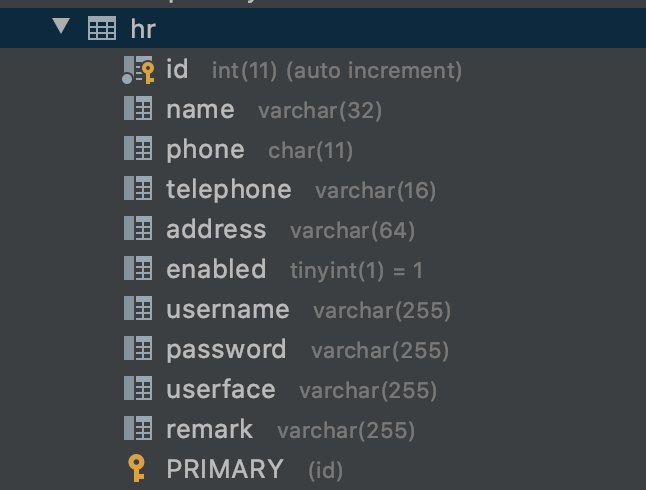

2. 建表并插入数据：

```sql
/*Table structure for table `hr` */
DROP TABLE IF EXISTS `hr`;
CREATE TABLE `hr` (
  `id` int(11) NOT NULL AUTO_INCREMENT COMMENT 'hrID',
  `name` varchar(32) DEFAULT NULL COMMENT '姓名',
  `phone` char(11) DEFAULT NULL COMMENT '手机号码',
  `telephone` varchar(16) DEFAULT NULL COMMENT '住宅电话',
  `address` varchar(64) DEFAULT NULL COMMENT '联系地址',
  `enabled` tinyint(1) DEFAULT '1',
  `username` varchar(255) DEFAULT NULL COMMENT '用户名',
  `password` varchar(255) DEFAULT NULL COMMENT '密码',
  `userface` varchar(255) DEFAULT NULL,
  `remark` varchar(255) DEFAULT NULL,
  PRIMARY KEY (`id`)
) ENGINE=InnoDB AUTO_INCREMENT=13 DEFAULT CHARSET=utf8;
/*Data for the table `hr` */
insert  into `hr`(`id`,`name`,`phone`,`telephone`,`address`,`enabled`,`username`,`password`,`userface`,`remark`) values (3,'系统管理员','18568887789','029-82881234','深圳南山',1,'admin','$2a$10$ySG2lkvjFHY5O0./CPIE1OI8VJsuKYEzOYzqIa7AJR6sEgSzUFOAm','http://bpic.588ku.com/element_pic/01/40/00/64573ce2edc0728.jpg',NULL),(5,'李白','18568123489','029-82123434','海口美兰',1,'libai','$2a$10$oE39aG10kB/rFu2vQeCJTu/V/v4n6DRR0f8WyXRiAYvBpmadoOBE.','https://timgsa.baidu.com/timg?image&quality=80&size=b9999_10000&sec=1514093920321&di=913e88c23f382933ef430024afd9128a&imgtype=0&src=http%3A%2F%2Fp.3761.com%2Fpic%2F9771429316733.jpg',NULL),(10,'韩愈','18568123666','029-82111555','广州番禺',1,'hanyu','$2a$10$oE39aG10kB/rFu2vQeCJTu/V/v4n6DRR0f8WyXRiAYvBpmadoOBE.','https://timgsa.baidu.com/timg?image&quality=80&size=b9999_10000&sec=1517070040185&di=be0375e0c3db6c311b837b28c208f318&imgtype=0&src=http%3A%2F%2Fimg2.soyoung.com%2Fpost%2F20150213%2F6%2F20150213141918532.jpg',NULL),(11,'柳宗元','18568123377','029-82111333','广州天河',1,'liuzongyuan','$2a$10$oE39aG10kB/rFu2vQeCJTu/V/v4n6DRR0f8WyXRiAYvBpmadoOBE.','https://timgsa.baidu.com/timg?image&quality=80&size=b9999_10000&sec=1515233756&di=0856d923a0a37a87fd26604a2c871370&imgtype=jpg&er=1&src=http%3A%2F%2Fwww.qqzhi.com%2Fuploadpic%2F2014-09-27%2F041716704.jpg',NULL),(12,'曾巩','18568128888','029-82111222','广州越秀',1,'zenggong','$2a$10$oE39aG10kB/rFu2vQeCJTu/V/v4n6DRR0f8WyXRiAYvBpmadoOBE.','https://timgsa.baidu.com/timg?image&quality=80&size=b9999_10000&sec=1517070040185&di=be0375e0c3db6c311b837b28c208f318&imgtype=0&src=http%3A%2F%2Fimg2.soyoung.com%2Fpost%2F20150213%2F6%2F20150213141918532.jpg',NULL);
```

#### 代码实现

1. 创建实体类Hr，实现接口UserDetails。getAuthorities方法是为了获取用户权限，role信息在后续loadUserByUsername方法中获取，权限信息在认证阶段用不到。

```java
public class Hr implements UserDetails {
    private Long id;
    private String name;
    private String phone;
    private String telephone;
    private String address;
    private boolean enabled;
    private String username;
    private String password;
    private String remark;
    private List<Role> roles;
    private String userface;

    @JsonIgnore
    @Override
    public Collection<? extends GrantedAuthority> getAuthorities() {
        List<GrantedAuthority> authorities = new ArrayList<>();
        for (Role role :roles) {
            authorities.add(new SimpleGrantedAuthority(role.getName()));
        }
        return authorities;
    }
  ...
}
//角色实体类
public class Role implements Serializable {
    private Integer id;
    private String name;
    private String nameZh;
  ...
}
```

2.创建HrMapper类，以及对应的HrMapper.xml

```java
@Mapper//这里使用mybatis，只要接口，不需要实现类
public interface HrMapper {
    //此方法在登录时会被自动调用，查询数据库是否存在该名字对应的用户
    public Hr loadUserByUsername(String s);
    //此方法在用户认证时用不上，在判断用户权限时被自动调用
    public List<Role> getHrRolesById(Long id);
}
```

```xml
<?xml version="1.0" encoding="UTF-8" ?>
<!DOCTYPE mapper PUBLIC "-//mybatis.org//DTD Mapper 3.0//EN" "http://mybatis.org/dtd/mybatis-3-mapper.dtd" >
<mapper namespace="com.lazyc.vuehr.mapper.HrMapper" >
    <resultMap id="BaseResultMap" type="com.lazyc.vuehr.pojo.Hr">
        <id column="id" property="id" jdbcType="INTEGER"/>
        <result column="name" property="name" jdbcType="VARCHAR"/>
        <result column="phone" property="phone" jdbcType="CHAR"/>
        <result column="telephone" property="telephone" jdbcType="VARCHAR"/>
        <result column="address" property="address" jdbcType="VARCHAR"/>
        <result column="enabled" property="enabled" jdbcType="BIT"/>
        <result column="username" property="username" jdbcType="VARCHAR"/>
        <result column="password" property="password" jdbcType="VARCHAR"/>
        <result column="userface" property="userface" jdbcType="VARCHAR"/>
        <result column="remark" property="remark" jdbcType="VARCHAR"/>
    </resultMap>
    <select id="loadUserByUsername" resultMap="BaseResultMap" >
        select * from hr where username=#{username}
    </select>
    <!--类属性名与数据库字段名能够完全对上时，可以直接使用resultType，否则需要建立如上resultMap映射-->
    <select id="getHrRolesById" resultType="com.lazyc.vuehr.pojo.Role">
        select r.* from role r, hr_role hrr where r.`id`=hrr.`hrid` and r.`id`=#{id}
    </select>
</mapper>
```

3. 创建HrService类，添加@Service注解注册到IoC容器，实现UserDetailsService接口。loadUserByUsername方法在用户登录时被调用。⚠️这里HrMapper虽然没写实现，但是可以自动注入。

```java
@Service
public class HrService implements UserDetailsService {
    @Autowired
    HrMapper hrMapper;
    @Override
    public UserDetails loadUserByUsername(String s) throws UsernameNotFoundException {
        Hr hr = hrMapper.loadUserByUsername(s);
        if (hr == null) {
            throw new UsernameNotFoundException("用户名不存在");
        }
        hr.setRoles(hrMapper.getHrRolesById(hr.getId()));
        //hr为UserDetails子类，此方法根据登录信息中的用户名，查询数据库，补全了角色信息
        return hr;
    }
}
```

至此，用户相关的Hr实体类、HrMapper接口、HrService类已完成，接下来进入安全认证逻辑。

4. 创建Security配置类SecurityConfig，继承WebSecurityConfigurerAdapter（若不自定义子类，默认使用后者认证逻辑）

  认证过程：用户发起登录请求->hrService的loadUserByUsername方法被调用->

- 返回hr对象为空，则若不存在该用户，抛用户名或者密码错误异常

- 返回hr对象不为空，则存在该用户，比对密码后返回结果（登录成功或者用户名密码错误异常）

```java
@Configuration
public class SecurityConfig extends WebSecurityConfigurerAdapter {
    @Autowired
    HrService hrService;

    @Bean//指定加密编码器，此处使用@Bean自动注册，也可以在下面第一个configure方法中指定。
    BCryptPasswordEncoder passwordEncoder() {
        return new BCryptPasswordEncoder();
    }

    @Override //应用起来时被首先调用，将用户服务类（hrService）注入AuthenticationManagerBuilder
    protected void configure(AuthenticationManagerBuilder auth) throws Exception {
        auth.userDetailsService(hrService);
    }

    @Override //应用起来时被自动调用
    public void configure(WebSecurity web) throws Exception {
    }

    @Override //应用起来时被自动调用
    protected void configure(HttpSecurity http) throws Exception {
        http.authorizeRequests()  //认证请求
                .anyRequest()     //任何请求
                .authenticated()  //都需要认证后访问
                .and()            //连接方法，进入下一个设置
                .formLogin()      //默认登录界面
                .usernameParameter("username")   //配置用户名参数，username为默认
                .passwordParameter("password")   //配置密码参数，password为默认
                //.loginPage("/login")           //登录页面，暂时未实现
                .loginProcessingUrl("/doLogin")  //登录url
                .successHandler(new AuthenticationSuccessHandler() {
                    @Override
                    public void onAuthenticationSuccess(HttpServletRequest req, HttpServletResponse resp, Authentication auth) throws IOException, ServletException {
                        resp.setContentType("application/json;charset=utf-8");
                        Hr hr = (Hr)auth.getPrincipal();
                        RespBean respBean = RespBean.ok("登陆成功!", hr);
                        writeRespBean(resp, respBean);
                    }
                })
                .failureHandler(new AuthenticationFailureHandler() {
                    @Override
                    public void onAuthenticationFailure(HttpServletRequest req, HttpServletResponse resp, AuthenticationException e) throws IOException, ServletException {
                        resp.setContentType("application/json;charset=utf-8");
                        RespBean respBean = null;
                        if (e instanceof BadCredentialsException) {
                            respBean = RespBean.error("用户名或者密码输入错误,请联系管理员.");
                        } else if (e instanceof CredentialsExpiredException) {
                            respBean = RespBean.error("密码过期,请联系管理员.");
                        } else if (e instanceof AccountExpiredException) {
                            respBean = RespBean.error("账户过期,请联系管理员.");
                        } else if (e instanceof LockedException) {
                            respBean = RespBean.error("账户锁定,请联系管理员.");
                        } else if (e instanceof DisabledException){
                            respBean = RespBean.error("账户被禁用,请联系管理员.");
                        } else {
                            respBean = RespBean.error("登录失败!");
                        }
                        writeRespBean(resp, respBean);
                    }
                })
                .permitAll()
                .and()
                .logout()
                .logoutSuccessHandler(new LogoutSuccessHandler() {
                    @Override
                    public void onLogoutSuccess(HttpServletRequest req, HttpServletResponse resp, Authentication auth) throws IOException, ServletException {
                        resp.setContentType("application/json;charset=utf-8");
                        RespBean respBean = RespBean.ok("退出成功!");
                        writeRespBean(resp, respBean);
                    }
                })
                .permitAll()
                .and()
                .csrf() //此处关闭csrf为防止postman调用失败
                .disable()
    }
      
  //此处抽取了3个回调的重复逻辑，其中RespBean为自定义类
  private void writeRespBean(HttpServletResponse resp, RespBean respBean) throws IOException{
        PrintWriter out = resp.getWriter();
        out.write(new ObjectMapper().writeValueAsString(respBean));
        out.flush();
        out.close();
    }
}
```

至此，认证逻辑完成，接下来测试。

#### 测试

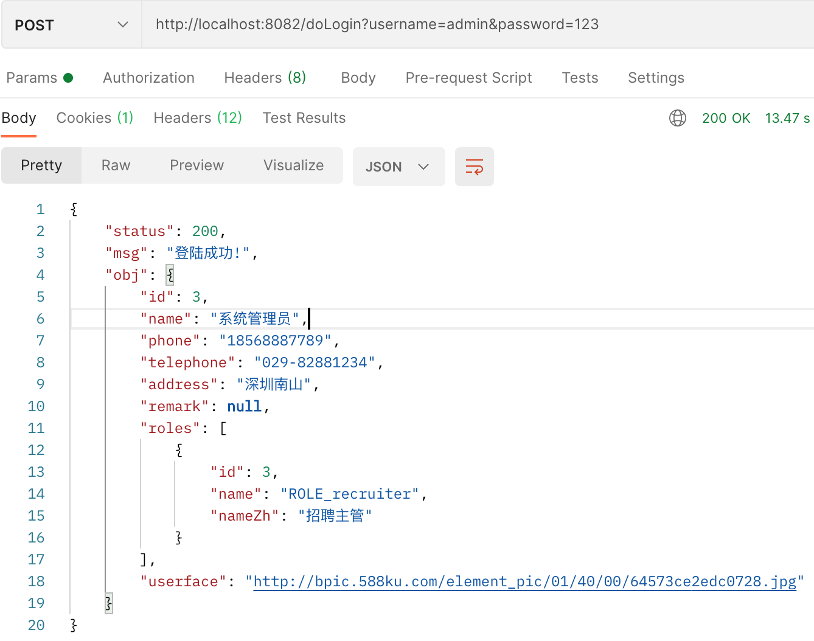

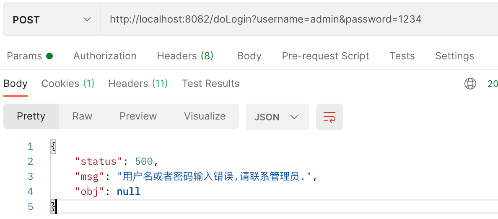

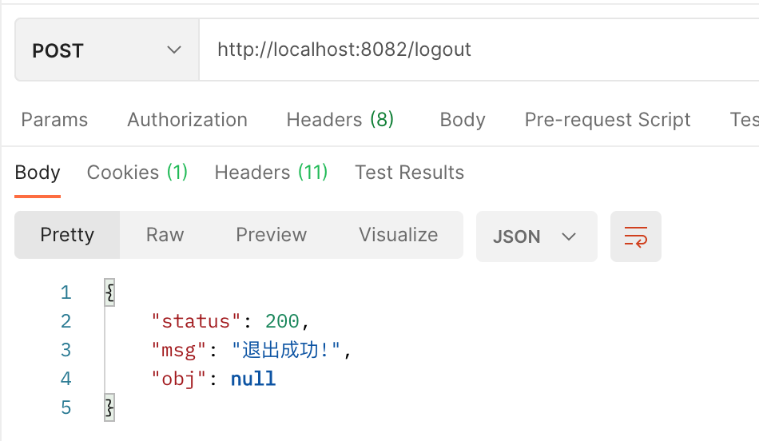

### 访问权限

#### 数据表设计

1. hr在系统中的角色表，字段name和nameZh分别为英文名和中文名

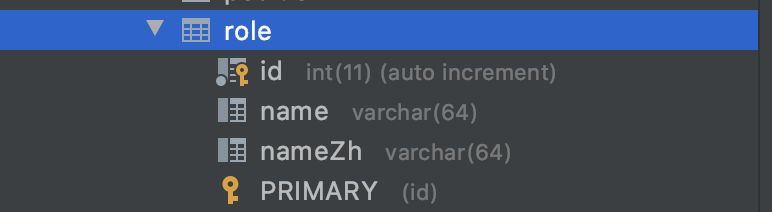

2. hr与role的关联表：

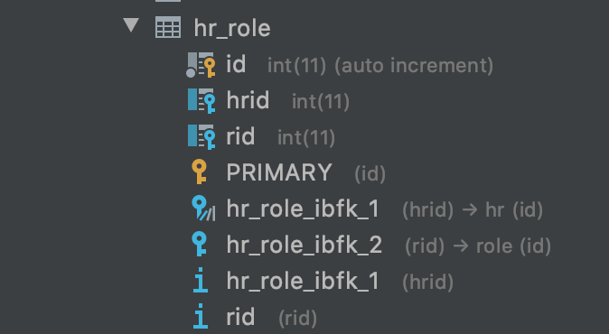

3. menu表

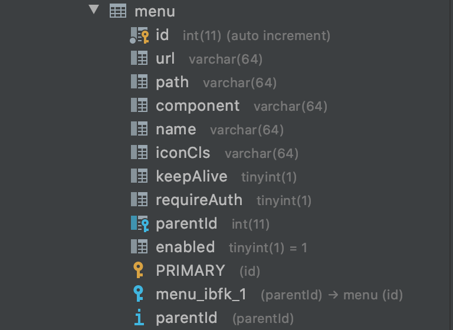

4. menu与role的关联表

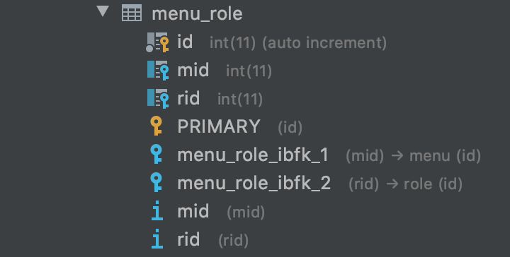

sql脚本

```sql
/*Table structure for table `role` */
DROP TABLE IF EXISTS `role`;
CREATE TABLE `role` (
  `id` int(11) NOT NULL AUTO_INCREMENT,
  `name` varchar(64) DEFAULT NULL,
  `nameZh` varchar(64) DEFAULT NULL COMMENT '角色名称',
  PRIMARY KEY (`id`)
) ENGINE=InnoDB AUTO_INCREMENT=22 DEFAULT CHARSET=utf8;
/*Data for the table `role` */
insert  into `role`(`id`,`name`,`nameZh`) values (1,'ROLE_manager','部门经理'),(2,'ROLE_personnel','人事专员'),(3,'ROLE_recruiter','招聘主管'),(4,'ROLE_train','培训主管'),(5,'ROLE_performance','薪酬绩效主管'),(6,'ROLE_admin','系统管理员'),(13,'ROLE_test2','测试角色2'),(14,'ROLE_test1','测试角色1'),(17,'ROLE_test3','测试角色3'),(18,'ROLE_test4','测试角色4'),(19,'ROLE_test4','测试角色4'),(20,'ROLE_test5','测试角色5'),(21,'ROLE_test6','测试角色6');
/*Table structure for table `hr_role` */
DROP TABLE IF EXISTS `hr_role`;
CREATE TABLE `hr_role` (
  `id` int(11) NOT NULL AUTO_INCREMENT,
  `hrid` int(11) DEFAULT NULL,
  `rid` int(11) DEFAULT NULL,
  PRIMARY KEY (`id`),
  KEY `rid` (`rid`),
  KEY `hr_role_ibfk_1` (`hrid`),
  CONSTRAINT `hr_role_ibfk_1` FOREIGN KEY (`hrid`) REFERENCES `hr` (`id`) ON DELETE CASCADE,
  CONSTRAINT `hr_role_ibfk_2` FOREIGN KEY (`rid`) REFERENCES `role` (`id`)
) ENGINE=InnoDB AUTO_INCREMENT=75 DEFAULT CHARSET=utf8;
/*Data for the table `hr_role` */
insert  into `hr_role`(`id`,`hrid`,`rid`) values (1,3,6),(35,12,4),(36,12,3),(37,12,2),(43,11,3),(44,11,2),(45,11,4),(46,11,5),(48,10,3),(49,10,4),(72,5,1),(73,5,2),(74,5,3);
```

3. menu表，系统菜单

```sql
/*Table structure for table `menu` */
DROP TABLE IF EXISTS `menu`;
CREATE TABLE `menu` (
  `id` int(11) NOT NULL AUTO_INCREMENT,
  `url` varchar(64) DEFAULT NULL,
  `path` varchar(64) DEFAULT NULL,
  `component` varchar(64) DEFAULT NULL,
  `name` varchar(64) DEFAULT NULL,
  `iconCls` varchar(64) DEFAULT NULL,
  `keepAlive` tinyint(1) DEFAULT NULL,
  `requireAuth` tinyint(1) DEFAULT NULL,
  `parentId` int(11) DEFAULT NULL,
  `enabled` tinyint(1) DEFAULT '1',
  PRIMARY KEY (`id`),
  KEY `parentId` (`parentId`),
  CONSTRAINT `menu_ibfk_1` FOREIGN KEY (`parentId`) REFERENCES `menu` (`id`)
) ENGINE=InnoDB AUTO_INCREMENT=29 DEFAULT CHARSET=utf8;
/*Data for the table `menu` */
insert  into `menu`(`id`,`url`,`path`,`component`,`name`,`iconCls`,`keepAlive`,`requireAuth`,`parentId`,`enabled`) values (1,'/',NULL,NULL,'所有',NULL,NULL,NULL,NULL,1),(2,'/','/home','Home','员工资料','fa fa-user-circle-o',NULL,1,1,1),(3,'/','/home','Home','人事管理','fa fa-address-card-o',NULL,1,1,1),(4,'/','/home','Home','薪资管理','fa fa-money',NULL,1,1,1),(5,'/','/home','Home','统计管理','fa fa-bar-chart',NULL,1,1,1),(6,'/','/home','Home','系统管理','fa fa-windows',NULL,1,1,1),(7,'/employee/basic/**','/emp/basic','EmpBasic','基本资料',NULL,NULL,1,2,1),(8,'/employee/advanced/**','/emp/adv','EmpAdv','高级资料',NULL,NULL,1,2,1),(9,'/personnel/emp/**','/per/emp','PerEmp','员工资料',NULL,NULL,1,3,1),(10,'/personnel/ec/**','/per/ec','PerEc','员工奖惩',NULL,NULL,1,3,1),(11,'/personnel/train/**','/per/train','PerTrain','员工培训',NULL,NULL,1,3,1),(12,'/personnel/salary/**','/per/salary','PerSalary','员工调薪',NULL,NULL,1,3,1),(13,'/personnel/remove/**','/per/mv','PerMv','员工调动',NULL,NULL,1,3,1),(14,'/salary/sob/**','/sal/sob','SalSob','工资账套管理',NULL,NULL,1,4,1),(15,'/salary/sobcfg/**','/sal/sobcfg','SalSobCfg','员工账套设置',NULL,NULL,1,4,1),(16,'/salary/table/**','/sal/table','SalTable','工资表管理',NULL,NULL,1,4,1),(17,'/salary/month/**','/sal/month','SalMonth','月末处理',NULL,NULL,1,4,1),(18,'/salary/search/**','/sal/search','SalSearch','工资表查询',NULL,NULL,1,4,1),(19,'/statistics/all/**','/sta/all','StaAll','综合信息统计',NULL,NULL,1,5,1),(20,'/statistics/score/**','/sta/score','StaScore','员工积分统计',NULL,NULL,1,5,1),(21,'/statistics/personnel/**','/sta/pers','StaPers','人事信息统计',NULL,NULL,1,5,1),(22,'/statistics/recored/**','/sta/record','StaRecord','人事记录统计',NULL,NULL,1,5,1),(23,'/system/basic/**','/sys/basic','SysBasic','基础信息设置',NULL,NULL,1,6,1),(24,'/system/cfg/**','/sys/cfg','SysCfg','系统管理',NULL,NULL,1,6,1),(25,'/system/log/**','/sys/log','SysLog','操作日志管理',NULL,NULL,1,6,1),(26,'/system/hr/**','/sys/hr','SysHr','操作员管理',NULL,NULL,1,6,1),(27,'/system/data/**','/sys/data','SysData','备份恢复数据库',NULL,NULL,1,6,1),(28,'/system/init/**','/sys/init','SysInit','初始化数据库',NULL,NULL,1,6,1);
/*Table structure for table `menu_role` */
DROP TABLE IF EXISTS `menu_role`;
CREATE TABLE `menu_role` (
  `id` int(11) NOT NULL AUTO_INCREMENT,
  `mid` int(11) DEFAULT NULL,
  `rid` int(11) DEFAULT NULL,
  PRIMARY KEY (`id`),
  KEY `mid` (`mid`),
  KEY `rid` (`rid`),
  CONSTRAINT `menu_role_ibfk_1` FOREIGN KEY (`mid`) REFERENCES `menu` (`id`),
  CONSTRAINT `menu_role_ibfk_2` FOREIGN KEY (`rid`) REFERENCES `role` (`id`)
) ENGINE=InnoDB AUTO_INCREMENT=283 DEFAULT CHARSET=utf8;
/*Data for the table `menu_role` */
insert  into `menu_role`(`id`,`mid`,`rid`) values (161,7,3),(162,7,6),(163,9,6),(164,10,6),(165,11,6),(166,12,6),(167,13,6),(168,14,6),(169,15,6),(170,16,6),(171,17,6),(172,18,6),(173,19,6),(174,20,6),(175,21,6),(176,22,6),(177,23,6),(178,25,6),(179,26,6),(180,27,6),(181,28,6),(182,24,6),(247,7,4),(248,8,4),(249,11,4),(250,7,2),(251,8,2),(252,9,2),(253,10,2),(254,12,2),(255,13,2),(256,7,1),(257,8,1),(258,9,1),(259,10,1),(260,11,1),(261,12,1),(262,13,1),(263,14,1),(264,15,1),(265,16,1),(266,17,1),(267,18,1),(268,19,1),(269,20,1),(270,21,1),(271,22,1),(272,23,1),(273,24,1),(274,25,1),(275,26,1),(276,27,1),(277,28,1),(280,7,14),(281,8,14),(282,9,14);
```

#### 代码实现

1. Menu实体类

```java
public class Menu implements Serializable {
    private Integer id;
    private String url;
    private String path;
    private String component;
    private String name;
    private String iconCls;
    private Meta meta;
    private Integer parentId;
    private Boolean enabled;
    private List<Menu> children;
    private List<Role> roles;
    ...
}
public class Meta implements Serializable {
    private boolean keepAlive;
    private boolean requireAuth;
		...
}
```

2. MenuMapper接口

```java
@Mapper
public interface MenuMapper {
    public List<Menu> getAllMenus();
    public List<Menu> getAllMenusWithRole();
}
```

MenuMapper.xml

```xml
<?xml version="1.0" encoding="UTF-8" ?>
<!DOCTYPE mapper PUBLIC "-//mybatis.org//DTD Mapper 3.0//EN" "http://mybatis.org/dtd/mybatis-3-mapper.dtd" >
<mapper namespace="com.lazyc.vuehr.mapper.MenuMapper" >
    <resultMap id="BaseResultMap" type="com.lazyc.vuehr.pojo.Menu" >
        <id column="id" property="id" jdbcType="INTEGER" />
        <result column="url" property="url" jdbcType="VARCHAR" />
        <result column="path" property="path" jdbcType="VARCHAR" />
        <result column="component" property="component" jdbcType="VARCHAR" />
        <result column="name" property="name" jdbcType="VARCHAR" />
        <result column="iconCls" property="iconCls" jdbcType="VARCHAR" />
        <result column="parentId" property="parentId" jdbcType="INTEGER" />
        <result column="enabled" property="enabled" jdbcType="BIT" />
        <association property="meta" javaType="com.lazyc.vuehr.pojo.Meta">
            <result column="keepAlive" property="keepAlive" jdbcType="BIT" />
            <result column="requireAuth" property="requireAuth" jdbcType="BIT" />
        </association>
    </resultMap>
    <resultMap id="MenuWithChildren" type="com.lazyc.vuehr.pojo.Menu" extends="BaseResultMap">
        <id column="id1" property="id"/>
        <result column="name1" property="name"/>
        <collection property="children" ofType="com.lazyc.vuehr.pojo.Menu">
            <id column="id2" property="id"/>
            <result column="name2" property="name"/>
            <collection property="children" ofType="com.lazyc.vuehr.pojo.Menu">
                <id column="id3" property="id"/>
                <result column="name3" property="name"/>
            </collection>
        </collection>
    </resultMap>
    <resultMap id="MenuWithRole" type="com.lazyc.vuehr.pojo.Menu" extends="BaseResultMap">
        <collection property="roles" ofType="com.lazyc.vuehr.pojo.Role">
            <id column="rid" property="id" />
            <result column="rname" property="name"/>
            <result column="rnameZh" property="nameZh"/>
        </collection>
    </resultMap>
    <select id="getAllMenus" resultMap="MenuWithChildren">
        select m1.`id` as id1,m1.`name` as name1,m2.`id` as id2,m2.`name` as name2,m3.`id` as id3,m3.`name` as name3 from menu m1,menu m2,menu m3 where m1.`id`=m2.`parentId` and m2.`id`=m3.`parentId` and m3.`enabled`=true order by m1.`id`,m2.`id`,m3.`id`
    </select>
    <select id="getAllMenusWithRole" resultMap="MenuWithRole">
        select m.*,r.`id` as rid, r.`name` as rname,r.`nameZh` as rnameZh from menu m,role r, menu_role mr where m.`id`=mr.`mid` and mr.`rid`=r.`id` order by m.`id`
    </select>
</mapper>
```

4. MenuService类

```java
@Service
public class MenuService {
    @Autowired
    MenuMapper menuMapper;
    public List<Menu> getAllMenus() {
        return menuMapper.getAllMenus();
    }
    public List<Menu> getAllMenusWithRole() {
        return menuMapper.getAllMenusWithRole();
    }
}
```

5. 定义CustomMetadataSource，实现接口FilterInvocationSecurityMetadataSource，该类为一个过滤器。

用户访问时，通过getAttributes方法，匹配URL对应的menu，分析得到需要的角色权限，

```java
@Component
public class CustomMetadataSource implements FilterInvocationSecurityMetadataSource {
    @Autowired
    MenuService menuService;
    AntPathMatcher antPathMatcher = new AntPathMatcher();

    @Override
    public Collection<ConfigAttribute> getAttributes(Object o) {
        String requestUrl = ((FilterInvocation)o).getRequestUrl();
        List<Menu> allMenu = menuService.getAllMenusWithRole();
        for (Menu menu: allMenu) {
            if (antPathMatcher.match(menu.getUrl(), requestUrl)
            && menu.getRoles().size() > 0) {
                List<Role> roles = menu.getRoles();
                String[] str = new String[roles.size()];
                for (int i = 0; i < roles.size(); i++) {
                   str[i] = roles.get(i).getName();
                }
                return SecurityConfig.createList(str);
            }
        }
        //若无匹配的角色权限，要求登录即可访问
        return  SecurityConfig.createList("ROLE_LOGIN");
    }
  
    @Override
    public Collection<ConfigAttribute> getAllConfigAttributes() {return null;}
    @Override
    public boolean supports(Class<?> aClass) {return true;}
}
```

6. 定义UrlAccessDecisionManager类，实现接口AccessDecisionManager

decide方法决定请求是否放行。参数attributes即为步骤5方法返回的角色权限列表。

当只需要“登录”（ROLE_LOGIN）时，则通过authentication类型判断当下是否已登录，若为AnonymousAuthenticationToken类型则表明当前为登录状态。

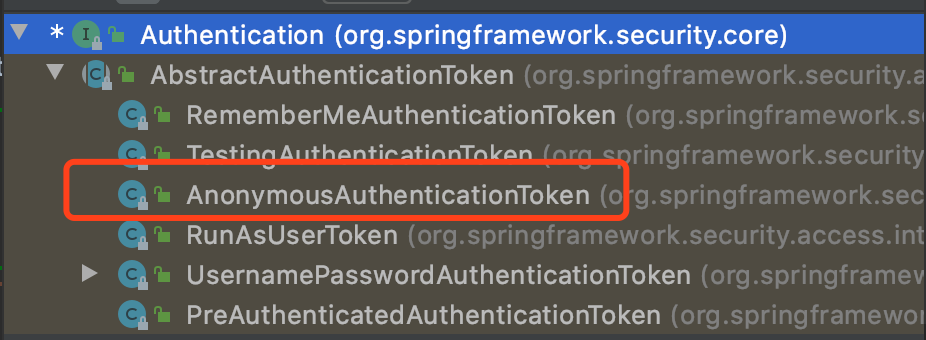

```java
@Component
public class UrlAccessDecisionManager implements AccessDecisionManager {
    @Override
    public void decide(Authentication authentication, Object o, Collection<ConfigAttribute> attributes) throws AccessDeniedException, InsufficientAuthenticationException {
        for (ConfigAttribute attribute : attributes) {
            String needRole = attribute.getAttribute();
            if("ROLE_LOGIN".equals(needRole)) {//只要登录即可放行
                if(authentication instanceof AnonymousAuthenticationToken) {
                    throw new AccessDeniedException("尚未登陆，请登录");
                } else {
                    return;
                }
            }
            //本方法获取当前登录用户拥有的权限，然后与访问要求的权限匹配
            //getAuthorities获取到用户角色权限过程：
            //1. 程序启动时，SecurityConfig中的configure方法注入hrService
            //2. 用户请求时，hrService的loadUserByUsername方法被调用，查询数据库得到hr信息，并返回hr对象
            //3. 调用hr的getAttributes方法，获取用户的角色权限（登录时，也是一样的流程）
            Collection<? extends GrantedAuthority> authorities = authentication.getAuthorities();
            for (GrantedAuthority authority : authorities) {
                if (authority.getAuthority().equals(needRole)) {
                    return;
                }
            }
        }
        //抛除权限不足异常，可自定义类处理
        throw new AccessDeniedException("权限不足，请联系管理员");
    }

    @Override
    public boolean supports(ConfigAttribute configAttribute) {
        return true;
    }

    @Override
    public boolean supports(Class<?> aClass) {
        return true;
    }
}
```

7. 定义拒绝访问异常处理类

```java
@Component
public class AuthenticationAccessDeniedHandler implements AccessDeniedHandler {
    @Override
    public void handle(HttpServletRequest httpServletRequest, HttpServletResponse httpServletResponse, AccessDeniedException e) throws IOException, ServletException {
        httpServletResponse.setStatus(HttpServletResponse.SC_FORBIDDEN);
        httpServletResponse.setContentType("application/json;charset=UTF-8");
        PrintWriter out = httpServletResponse.getWriter();
        RespBean error = RespBean.error("权限不足，请联系管理员");
        out.write(new ObjectMapper().writeValueAsString(error));
        out.flush();
        out.close();
    }
}
```

8. 改造SecurityConfig方法：

```java
@Configuration
public class SecurityConfig extends WebSecurityConfigurerAdapter {
    @Autowired
    HrService hrService;
    /************************注入三个bean**************************/
    @Autowired
    CustomMetadataSource metadataSource;
    @Autowired
    UrlAccessDecisionManager urlAccessDecisionManager;
    @Autowired
    AuthenticationAccessDeniedHandler denieVdHandler;
    /***********************************************************/

    private void writeRespBean(HttpServletResponse resp, RespBean respBean) throws IOException{
        PrintWriter out = resp.getWriter();
        out.write(new ObjectMapper().writeValueAsString(respBean));
        out.flush();
        out.close();
    }

    @Bean
    BCryptPasswordEncoder passwordEncoder() {
        return new BCryptPasswordEncoder();
    }
    @Override
    protected void configure(AuthenticationManagerBuilder auth) throws Exception {
        auth.userDetailsService(hrService);
    }
    @Override
    public void configure(WebSecurity web) throws Exception {
    }

    @Override
    protected void configure(HttpSecurity http) throws Exception {
        http.authorizeRequests()
                /************************注入两个bean**************************/
                .withObjectPostProcessor(new ObjectPostProcessor<FilterSecurityInterceptor>() {
                    @Override
                    public <O extends FilterSecurityInterceptor> O postProcess(O o) {
                        o.setSecurityMetadataSource(metadataSource);
                        o.setAccessDecisionManager(urlAccessDecisionManager);
                        return o;
                    }
                })
          			/************************************************************/
                .anyRequest()
                .authenticated()
                .and()
                .formLogin()
                .usernameParameter("username")
                .passwordParameter("password")
                //.loginPage("/login")
                .loginProcessingUrl("/doLogin")
                .successHandler(new AuthenticationSuccessHandler() {...})
                .failureHandler(new AuthenticationFailureHandler() {...})
                .permitAll()
                .and()
                .logout()
                .logoutSuccessHandler(new LogoutSuccessHandler() {...})
                .permitAll()
                .and()
                .csrf()
                .disable()
                .exceptionHandling()
          			/************************加入拒绝访问处理**********************/
                .accessDeniedHandler(deniedHandler);
    }
}
```

#### 测试

1. 登录，用户admin查询数据库可知，为招聘主管（ROLE_recruiter），访问权限对应URL为/employee/basic/**

`http://localhost:8082/doLogin?username=admin&password=123`

2.访问/employee/basic/hello （这里添加了一个HelloCtroller类作为测试类）

`http://localhost:8082/employee/basic/hello`

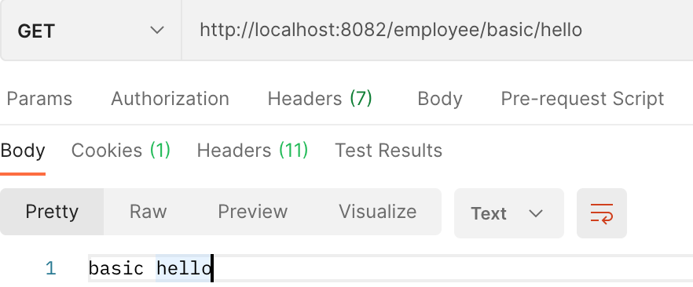

3. 访问/employee/advanced/hello，权限不足

`http://localhost:8082/employee/advanced/hello`

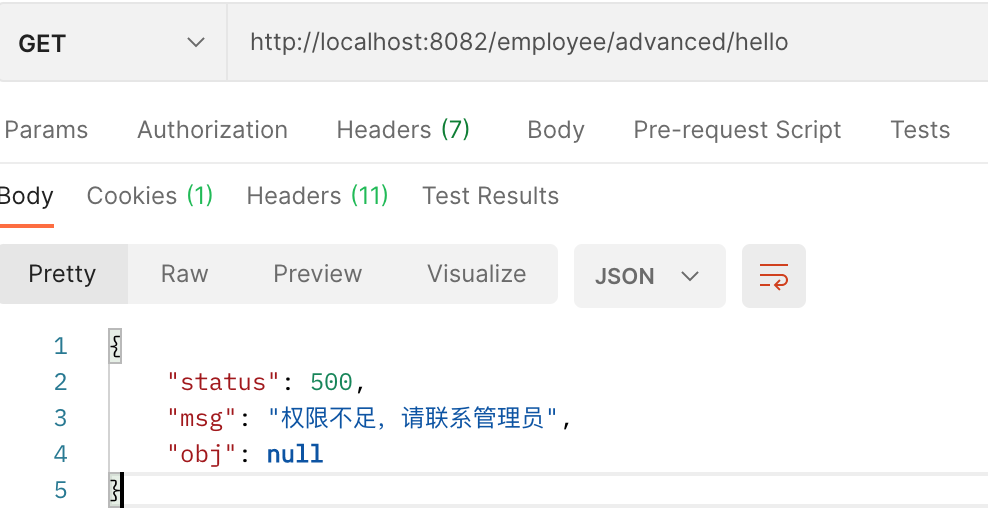

